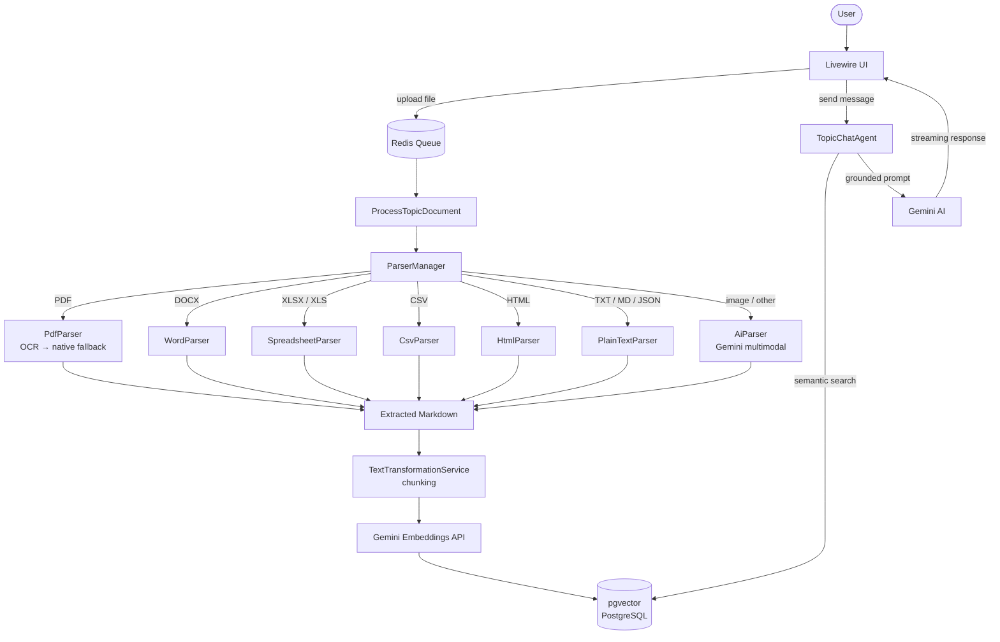

# RAG — Retrieval-Augmented Generation

A Laravel application for uploading documents, extracting and embedding their content, and chatting with an AI assistant grounded in those documents.

> Vibe Coded. Not production-ready.

## Requirements

- PHP 8.3+
- Node.js 20+
- PostgreSQL with the `pgvector` extension
- Redis
- Tesseract OCR```brew install tesseract tesseract-lang```
- Imagick / Ghostscript (for PDF-to-image conversion via `spatie/pdf-to-image`)

## Installation

```bash

composer install
cp .env.example .env
php artisan key:generate
php artisan migrate
npm install && npm run build
```

## Environment Variables

| Key | Required | Description |
|-----|----------|-------------|
| `GEMINI_API_KEY` | Yes | Google Gemini API key used for chat, embeddings, and document parsing |

### OCR

| Key | Default | Description |
|-----|---------|-------------|
| `TESSERAT_BINARY` | `/opt/homebrew/bin/tesseract` | Absolute path to the `tesseract` binary |

## Development

### Starting services

```bash
# Start queue worker (Horizon)
php artisan horizon

# Watch assets
npm run dev
```

### Linting

```bash
vendor/bin/pint
```

## Architecture



## Features

- **Topics** — organise documents into isolated knowledge bases called topics. Each topic has its own document set and chat history.
- **Document upload** — upload one or more documents to a topic. Processing (extraction + embedding) runs automatically in the background via a queued job.
- **Multi-format parsing** — structured parsers extract clean Markdown from common file types (see [Parsers](#parsers) below). Files without a registered parser fall back to a Gemini-powered AI extraction agent.
- **Vector embeddings** — extracted text is chunked and embedded via the `laravel/ai` Embeddings API. Chunks are stored in PostgreSQL using `pgvector`.
- **RAG chat** — ask questions about a topic's documents. The chat agent performs semantic search over embedded chunks and grounds its response in retrieved context, streaming the reply in real time.
- **Follow-up suggestions** — the assistant surfaces up to three follow-up questions after each response.
- **Document viewer** — view the extracted text or raw file of any uploaded document directly in the UI.
- **Chat history** — conversation history is persisted per topic, including token usage per message.
- **Queue processing with Horizon** — document processing is handled by Laravel Horizon with configurable workers and retry logic.

## Parsers

Each parser converts a file into clean Markdown text that is then chunked and embedded.

| Parser | Supported formats | Notes |
|--------|-------------------|-------|
| `PdfParser` | `.pdf` | Attempts OCR first (Tesseract, page-by-page); falls back to native text extraction via `smalot/pdfparser`. OCR languages configurable per document via `metadata.tesseract_ocr_languages`. |
| `WordParser` | `.docx` | Extracts headings, paragraphs, lists, and tables as Markdown via `phpoffice/phpword`. |
| `SpreadsheetParser` | `.xlsx`, `.xls` | Converts each worksheet into a Markdown table (one section per sheet) via `phpoffice/phpspreadsheet`. |
| `CsvParser` | `.csv` | Reads the first row as headers and renders all rows as a Markdown table via `league/csv`. |
| `HtmlParser` | `.html`, `.xhtml` | Strips non-content tags (scripts, styles, nav, header, footer, aside) and converts to plain text via `voku/html2text`. |
| `PlainTextParser` | `.txt`, `.md`, `.json` | Reads and normalises whitespace — no transformation. |
| `AiParser` _(fallback)_ | images, and any other format | Sends the file to a Gemini multimodal agent (`ParseDocumentAgent`) for text extraction. Used automatically when no specific parser matches the file's MIME type. |
